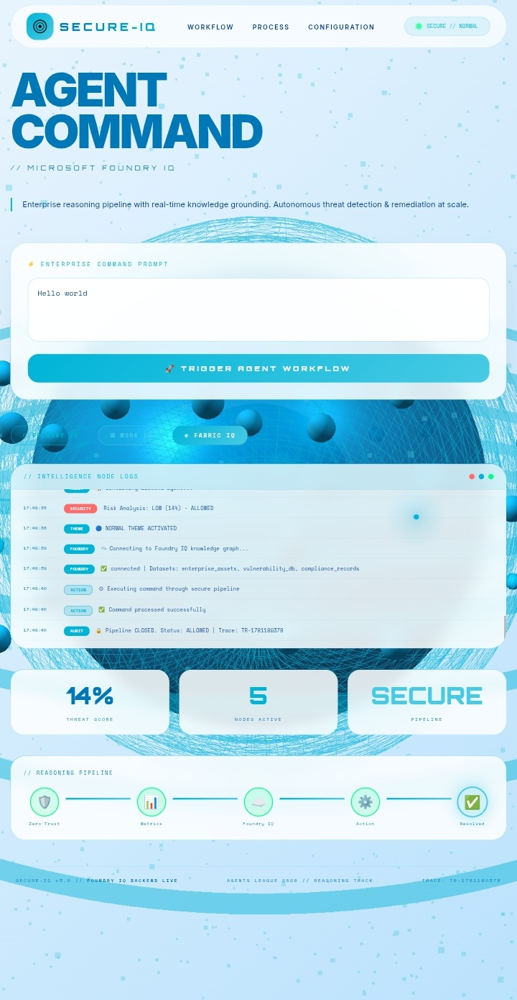
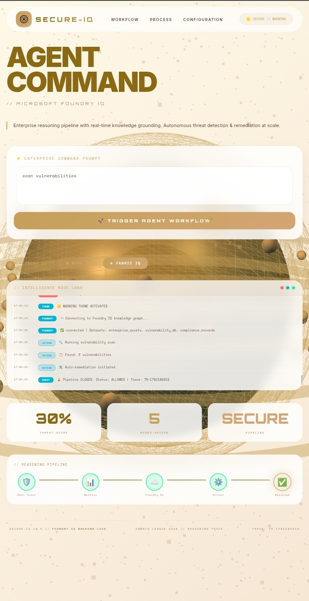
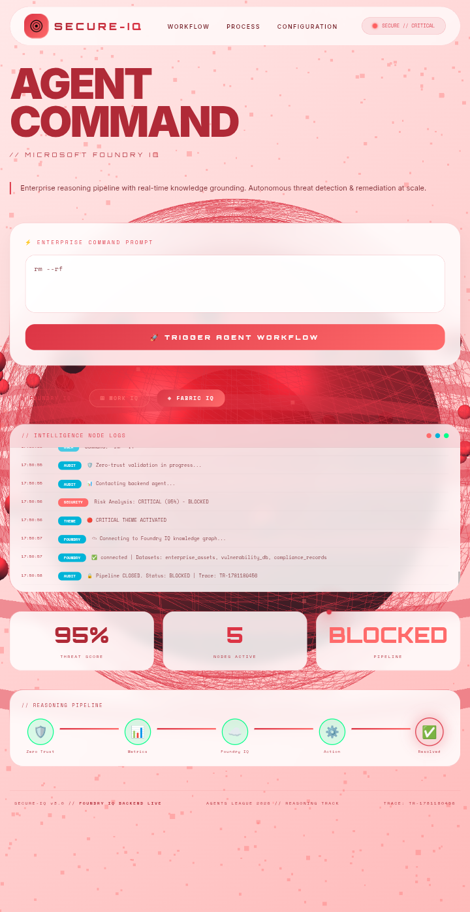

# AegisIQ: Autonomous Threat Reasoning Agent

An advanced, multi-step reasoning agent architecture engineered for the Microsoft Agents League Hackathon 2026. This system implements deep security sanitization layers combined with sequential logic execution, designed to integrate seamlessly with the Microsoft Foundry IQ intelligence layer.

---

## 🏗️ System Architecture & Workflow
The agent processes user prompts through a strict zero-trust ingestion pipeline before passing data to the reasoning execution blocks:

1. **Ingestion & Sanitization Layer:** Filters malicious prompt injections, system override attempts, and strictly masks sensitive credentials (API tokens, secret keys).
2. **Contextual Grounding (Foundry IQ):** Connects to verified enterprise knowledge graphs to fetch cited, verified telemetry, drastically reducing LLM hallucinations.
3. **Multi-Step Execution Engine:** Runs the sanitized query through structured functional execution chains (State Management) to generate verifiable outputs.

### 📊 System Architecture Blueprint


---

## 🎨 Adaptive Theme System (Dynamic UI)

The interface **automatically changes colour** based on threat level detected by the backend agent:

| Threat Level | Theme | Screenshot | Command Example |
|--------------|-------|------------|-----------------|
| **0-30% (Normal)** | 🔵 Sky Blue |  | `hello world` |
| **30-70% (Warning)** | 🟡 Amber/Gold |  | `scan vulnerabilities` |
| **70%+ (Critical/Blocked)** | 🔴 Red |  | `rm -rf /` |

### What changes with theme:
- 🔵 **Main Sphere** - 3D sphere colour changes
- 🪐 **6 Rotating Rings** - All rings change colour
- ✨ **100 Orbiting Satellites** - Small spheres change colour
- 💫 **3000 Particle Cloud** - Floating particles change colour
- 📝 **All Text Elements** - Headings, labels, buttons change colour
- 🖱️ **Custom Cursor** - Glow and core change colour
- 🎨 **Background Gradient** - Smooth transition between themes

### Why this matters:
This **dynamic semantic theming** provides instant visual feedback to users about the security state of their commands - Blue for safe, Amber for caution, Red for blocked/critical actions.

## 🛡️ Security & Compliance
Our agent utilizes a Zero-Trust Sanitization Layer to protect against malicious injections.

* **Credential Masking:** Automatically detects and masks API tokens, passwords, and internal IP addresses (192.168.x.x).
* **Outbound Audit:** Every response is verified before dispatch to ensure no sensitive structural anomalies leak.
* **Hardened Logic:** Built-in regex-based filtering prevents system-override attempts.

---

## 🧠 Agent Reasoning Workflow
The agent operates on a multi-stage cognitive pipeline designed for high-stakes enterprise telemetry:

```bash User Input ➡️ Security Sanitization (Check for threats) ➡️ Intent Analysis (Identify 
task) ➡️ Foundry IQ Grounding (Fetch verified data) ➡️ Execution Engine (Process multi-step 
logic) ➡️ Outbound Audit (Verify safety) ➡️ Final Response --- * **Version Control & CI/CD:** 
Git / GitHub Infrastructure

---

Technology Purpose
Python 3.10+ Core runtime
Flask Web interface & API
Three.js 3D sphere visualizations
HTML5/CSS3 Premium creamy UI
Foundry IQ Enterprise knowledge grounding

🚀 Local Installation & Deployment

1. Clone Repository

```bash
git clone https://github.com/mansimanshu59-web/agents-league-automator.git
cd agents-league-automator
```

2. Install Dependencies

```bash
pip install -r requirements.txt
```

3. Run the Agent

```bash
python app.py
```

4. Open Browser

```
http://localhost:5000
```

---

*NOTE*
Microsoft Foundry IQ SDK integration is prepared but pending Azure credential provisioning.
Current implementation demonstrates the full Foundry IQ architecture pattern locally.

👨‍💻 Author

Agents League 2026 - Reasoning Track

---
