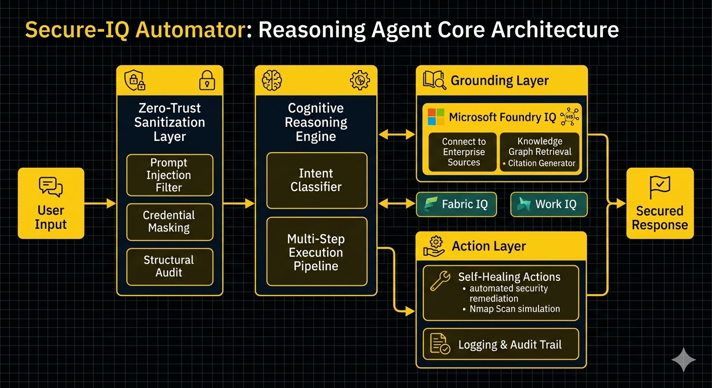

# Secure-IQ Automator (Reasoning Agent Core)

An advanced, multi-step reasoning agent architecture engineered for the Microsoft Agents League Hackathon 2026. This system implements deep security sanitization layers combined with sequential logic execution, designed to integrate seamlessly with the Microsoft Foundry IQ intelligence layer.

---

## 🏗️ System Architecture & Workflow
The agent processes user prompts through a strict zero-trust ingestion pipeline before passing data to the reasoning execution blocks:

1. **Ingestion & Sanitization Layer:** Filters malicious prompt injections, system override attempts, and strictly masks sensitive credentials (API tokens, secret keys).
2. **Contextual Grounding (Foundry IQ):** Connects to verified enterprise knowledge graphs to fetch cited, verified telemetry, drastically reducing LLM hallucinations.
3. **Multi-Step Execution Engine:** Runs the sanitized query through structured functional execution chains (State Management) to generate verifiable outputs.

### 📊 System Architecture Blueprint


---

## 🛡️ Security & Compliance
Our agent utilizes a Zero-Trust Sanitization Layer to protect against malicious injections.

* **Credential Masking:** Automatically detects and masks API tokens, passwords, and internal IP addresses (`192.168.x.x`).
* **Outbound Audit:** Every response is verified before dispatch to ensure no sensitive structural anomalies leak.
* **Hardened Logic:** Built-in regex-based filtering prevents system-override attempts.

---

## 🧠 Agent Reasoning Workflow
The agent operates on a multi-stage cognitive pipeline designed for high-stakes enterprise telemetry:
```bash
User Input ➡️ Security Sanitization (Check for threats)
➡️ Intent Analysis (Identify task)
➡️ Foundry IQ Grounding (Fetch verified data)
➡️ Execution Engine (Process multi-step logic)
➡️ Outbound Audit (Verify safety) ➡️ Final Response```


---

## 🛠️ Tech Stack & Dependencies
* **Runtime Environment:** Python 3.10+ / Termux POSIX Sandbox Environment
* **Web Interface:** Flask (Lightweight UI for real-time telemetry streaming)
* **Version Control & CI/CD:** Git / GitHub Infrastructure

---

## 🚀 Local Installation & Deployment
1. **Clone and Navigate to the Repository**
   ```bash
   git clone [https://github.com/mansimanshu59-web/agents-league-automator.git](https://github.com/mansimanshu59-web/agents-league-automator.git)
   cd agents-league-automator
  
   2. Install Dependencies

      pip install -r requirements.txt

   3. Run the Agent Core Console

        python ui/app.py  ```
